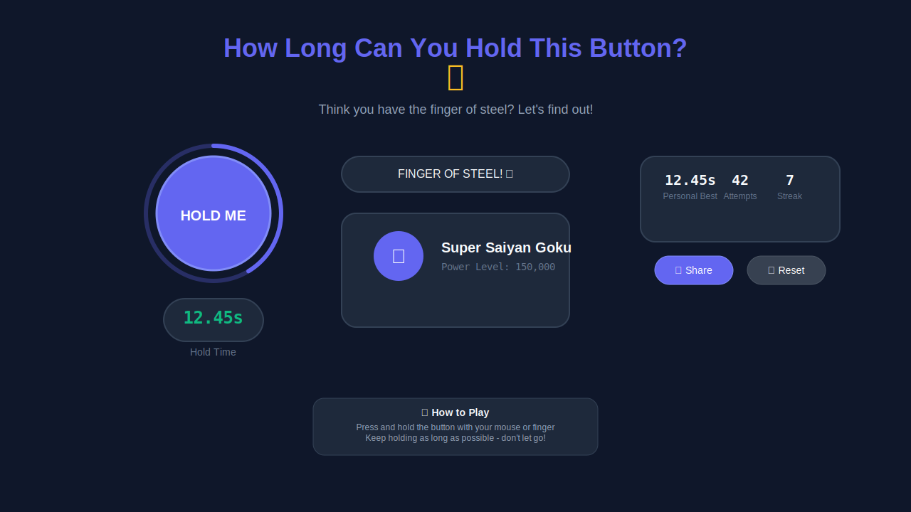

# 🎯 How Long Can You Hold This Button?

[](https://web.dev/pwa-checklist/)
[](https://developers.google.com/web/tools/lighthouse)
[](https://web.dev/responsive-web-design-basics/)
[](https://developer.mozilla.org/en-US/docs/Web/JavaScript)

> **The viral web game that tests your patience and rewards your persistence with increasingly ridiculous praise!**

A Progressive Web App that challenges users to hold down a button for as long as possible while receiving escalating praise messages from "Button Novice" to "Transcendent Being of Infinite Patience." Features offline play, social sharing, achievements, and can be installed like a native app on any device.




## 🚀 Quick Start

### Play Online
Visit the live app: [Add your deployment URL here]

### Install as App
1. **Chrome/Edge**: Click the install icon in the address bar
2. **Safari (iOS)**: Tap Share → Add to Home Screen  
3. **Android**: Tap menu → Install App

## ✨ Features

### 🎮 Core Gameplay
- **Simple Concept**: Hold the button, get praised
- **Progressive Praise**: Messages get more ridiculous over time
- **Timer Display**: Real-time countdown with smooth animations
- **Visual Feedback**: Button animations, glow effects, and progress rings

### 📱 Progressive Web App
- **Offline Play**: Works without internet connection
- **Installable**: Add to home screen on any device
- **Fast Loading**: Optimized for instant startup
- **Cross-Platform**: Works on iOS, Android, Windows, macOS

### 🏆 Gamification
- **Achievement System**: Unlock milestones for holding times
- **Statistics Tracking**: Best time, total attempts, current streak
- **Easter Eggs**: Special messages at specific times (7s, 42s, 69s, 420s)
- **Leaderboard Ready**: Local high scores with export capability

### 🌐 Social Features
- **Share Achievements**: Twitter, Facebook, native sharing
- **Copy Link**: Easy sharing with friends
- **Viral Mechanics**: Encouraging messages promote sharing

### 🎨 User Experience
- **Responsive Design**: Perfect on phones, tablets, and desktops
- **Smooth Animations**: CSS transitions and micro-interactions
- **Accessibility**: Keyboard support and screen reader friendly
- **Dark/Light Theme**: Respects system preferences

## 🛠️ Built With

- **Frontend**: Vanilla JavaScript (ES6+), HTML5, CSS3
- **PWA**: Service Worker, Web App Manifest
- **Storage**: LocalStorage for persistence
- **Icons**: Custom SVG icons for all platforms
- **Animations**: CSS Custom Properties and Transitions

## 🏃‍♂️ Local Development

### Prerequisites
- Modern web browser (Chrome, Firefox, Safari, Edge)
- Local web server (for PWA features to work properly)

### Installation

1. **Clone the repository**
   ```bash
   git clone [your-repo-url]
   cd todo2-test5
   ```

2. **Start a local server**
   
   **Option A: Python**
   ```bash
   # Python 3
   python -m http.server 8000
   
   # Python 2
   python -m SimpleHTTPServer 8000
   ```
   
   **Option B: Node.js**
   ```bash
   npx serve .
   # or
   npx http-server
   ```
   
   **Option C: PHP**
   ```bash
   php -S localhost:8000
   ```

3. **Open in browser**
   ```
   http://localhost:8000
   ```

### Development Notes
- Service Worker only works over HTTPS or localhost
- For PWA testing, use Chrome DevTools → Application tab
- Test offline functionality by going offline in DevTools

## 🚀 Deployment

### GitHub Pages

1. **Enable GitHub Pages**
   - Go to repository Settings → Pages
   - Select source branch (usually `main`)
   - Your app will be available at `https://username.github.io/repository-name`

2. **Custom Domain (Optional)**
   - Add `CNAME` file with your domain
   - Configure DNS settings

### Netlify

1. **Connect Repository**
   - Sign up at [netlify.com](https://netlify.com)
   - Click "New site from Git"
   - Connect your GitHub repository

2. **Deploy Settings**
   ```
   Build command: (leave empty)
   Publish directory: (leave empty or "./")
   ```

3. **Custom Domain**
   - Go to Site settings → Domain management
   - Add custom domain and configure DNS

### Vercel

1. **Deploy with Vercel**
   ```bash
   npm i -g vercel
   vercel
   ```
   
2. **Or use the Dashboard**
   - Visit [vercel.com](https://vercel.com)
   - Import your GitHub repository
   - Deploy automatically

### Manual Hosting

Upload all files to any web server. Ensure:
- All files are accessible via HTTPS
- Proper MIME types are set (especially for `.webmanifest`)
- Service Worker is served with correct headers

## 🎯 How to Play

1. **Start**: Click the big button to begin
2. **Hold**: Keep holding! Don't let go!
3. **Watch**: See your praise messages evolve
4. **Achieve**: Unlock milestones and achievements
5. **Share**: Brag about your incredible patience
6. **Repeat**: Try to beat your personal best

### Praise Message Progression

- **0-5s**: Button Novice, Finger Warrior
- **10-30s**: Steadfast Soul, Persistence Pioneer  
- **1-2min**: Endurance Expert, Patience Prodigy
- **5min+**: Zen Master, Digital Monk
- **10min+**: Transcendent Being of Infinite Patience
- **Special**: Easter egg messages at 7s, 42s, 69s, 420s

## 📊 Browser Support

| Browser | Version | PWA Install | Offline | Sharing |
|---------|---------|-------------|---------|---------|
| Chrome | 67+ | ✅ | ✅ | ✅ |
| Firefox | 79+ | ✅ | ✅ | ⚠️ |
| Safari | 11.1+ | ✅ | ✅ | ✅ |
| Edge | 79+ | ✅ | ✅ | ✅ |

⚠️ = Limited support

## 🐛 Troubleshooting

### PWA Not Installing
- Ensure you're using HTTPS or localhost
- Check that manifest.json is properly linked
- Verify Service Worker is registered

### Offline Not Working
- Service Worker must be registered successfully
- Check browser DevTools → Application → Service Workers
- Clear cache and reload if needed

### Timer Issues
- Ensure JavaScript is enabled
- Check for browser extensions blocking scripts
- Try refreshing the page

### Social Sharing Not Working
- Web Share API requires HTTPS
- Fallback to manual sharing if native sharing fails
- Check browser support for Web Share API

## 🤝 Contributing

We welcome contributions! Here's how to help:

1. **Fork the repository**
2. **Create a feature branch**
   ```bash
   git checkout -b feature/amazing-feature
   ```
3. **Make your changes**
4. **Test thoroughly** (all devices, offline mode, PWA install)
5. **Commit with clear messages**
   ```bash
   git commit -m "Add amazing feature: description"
   ```
6. **Push and create Pull Request**

### Development Guidelines
- Keep it simple and fast
- Test on mobile devices
- Maintain PWA compliance
- Follow existing code style
- Update documentation

## 📝 License

This project is licensed under the MIT License - see the [LICENSE](LICENSE) file for details.

## 🙏 Acknowledgments

- Inspired by the simple joy of button holding games
- Built with modern web standards and PWA best practices
- Thanks to the web development community for tools and inspiration

## 📞 Support

- 🐛 **Bug Reports**: [Create an issue](../../issues)
- 💡 **Feature Requests**: [Start a discussion](../../discussions)
- 📧 **Contact**: [Add your contact info]

---

**Made with ❤️ and infinite patience**

*Can you hold the button longer than the developer? Challenge accepted!* 